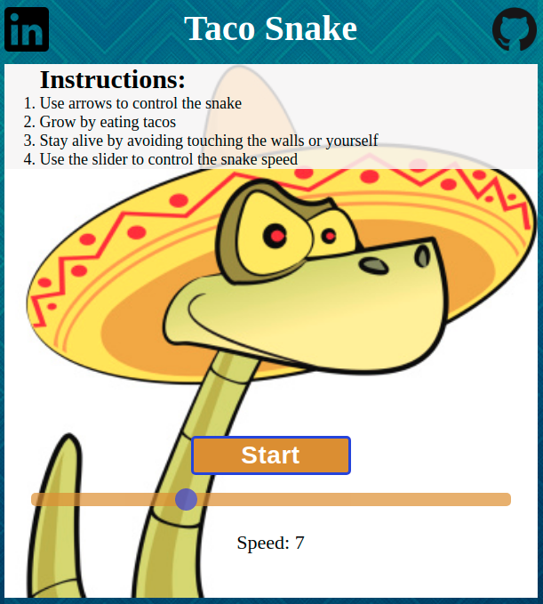

# Snake Taco
[Live Link](https://odomj5.github.io/snake-game/)

# Background

Snake Taco is a simple 1-player game, insipred by the classic Nokia Snake.  The object of the game is to eat as many tacos as possible to grow the snake without hitting the border or snake's body. 

# Controls 
* Select desired speed difficutly 
* Use the arrow keys to control the snake's direction 

# Architecture and Technologies
* Vanilla JavaScript for game logic and event handlers
* HTML5 Canvas for DOM manipulation and rendering

